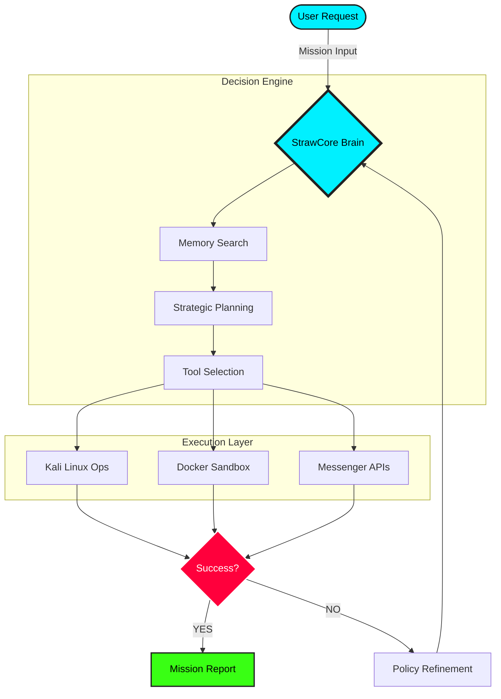

<div align="center">
  
  
  # 💠 StrawCore AI: The Ultimate Autonomous Agency
  
  [**Website**](https://straw-hat-ai.vercel.app/) | [**Documentation** (Restricted)](#) | [**API Access** (Private)](#)
  
  [](#)
  [](#)
  [](#)
  [](#)

  ---

  ### "One Core. Infinite Use Cases. Powered by Autonomy."

  *StrawCore AI is a next-generation autonomous agent designed for high-stakes environments. From automated penetration testing to intelligent automation, StrawCore AI thinks, plans, and executes missions on its own.*

  ---
  
   
  *(Note: The above is a conceptual mockup of the StrawCore AI Control Center)*

</div>

---

## 🚀 Core Mission Capabilities

StrawCore AI operates with a modular architecture of specialized "Crews." These agents are not just bots; they are autonomous entities capable of complex decision-making and tool-use.

| Squad | Specialization | Mission Status | Efficiency (Real-time) |
| :--- | :--- | :--- | :--- |
| **🛡️ CyberCrew** | Autonomous Pentesting, Recon, & Vuln Scanning | `STABLE` | █ █ █ █ █ █ █ █ █ ░ 90% |
| **💻 DevCrew** | Autonomous Coding, PR Reviews, & CI/CD | `ACTIVE` | █ █ █ █ █ █ █ █ ░ ░ 85% |
| **⚙️ AutoCrew** | Multi-channel Bots & Workflow Automation | `BETA` | █ █ █ █ █ █ ░ ░ ░ ░ 65% |
| **🧠 IntelCrew** | LLM Orchestration & Computer Vision | `EVOLVING` | █ █ █ █ █ █ █ █ █ █ 100% |

> [!TIP]
> Each squad can be deployed independently or as a combined force for multi-vector operations.

---

## 🛠 The Tech Stack: "Zero-Trust Autonomy"

StrawCore is built on a foundation of privacy and power. Every component is containerized and isolated.

- 🐧 **Custom Kali OS Cloud**: Hardened Linux environments for security missions.
- 🐳 **Docker-at-Scale**: Dynamic container spinning for tool isolation.
- 🗣 **Multi-Agent Orchestration**: Proprietary logic governing agent interactions.
- 🧠 **Private LLM Backbone**: Running `Llama 3`, `DeepSeek`, or `Ollama` locally—zero data leaves the perimeter.
- 👁 **Neural Vision Core**: OpenCV and YOLO integration for GUI-based autonomous interactions.
- 🖇 **Open Claw Integration**: Utilizing the latest in autonomous planning protocols.

---

## ⛓️ The Autonomous Lifecycle (Animated Workflow)



---

## 📦 Architecture (Showcase)

This repository contains a high-level representation of the StrawCore architecture. 

```python
# StrawCore AI Orchestrator Snippet
from core.brain import AutonomousPlanner
from tools.kali import SecurityScanner

async def start_mission(target_url):
    planner = AutonomousPlanner(context="SecurityAudit")
    plan = await planner.create_plan(target_url)
    
    async with SecurityScanner() as scanner:
        results = await scanner.execute_plan(plan)
        return results
```

Check out the [`src/`](src/) directory to understand our modular approach to building autonomous systems.

---

## 🗺️ Strategic Roadmap 2026

We are constantly evolving StrawCore AI to meet the demands of the next-generation autonomous landscape.

| Phase | Focus | Status |
| :--- | :--- | :--- |
| **Q1: Foundation** | Core Brain Optimization & Multi-Tool Orchestration | `COMPLETED` |
| **Q2: Expansion** | Native WhatsApp/Telegram UI for Mobile Mission Control | `IN PROGRESS` |
| **Q3: Intelligence** | Distributed Local Inference & Multi-Agent Swarm Logic | `PLANNED` |
| **Q4: Maturity** | Self-Healing Architecture & Autonomous Exploit Generation | `RESEARCH` |

---

## ⚖️ License

**© 2026 StrawCore AI. All Rights Reserved.**

This repository is for **demonstration and showcase purposes only**. The source code is proprietary and not open for public distribution or commercial use without a valid license from the StrawCore AI Team.

---

<div align="center">
  <sub>Built with ❤️ by the StrawCore AI Team. Inspired by the spirit of freedom and autonomy.</sub>
</div>
