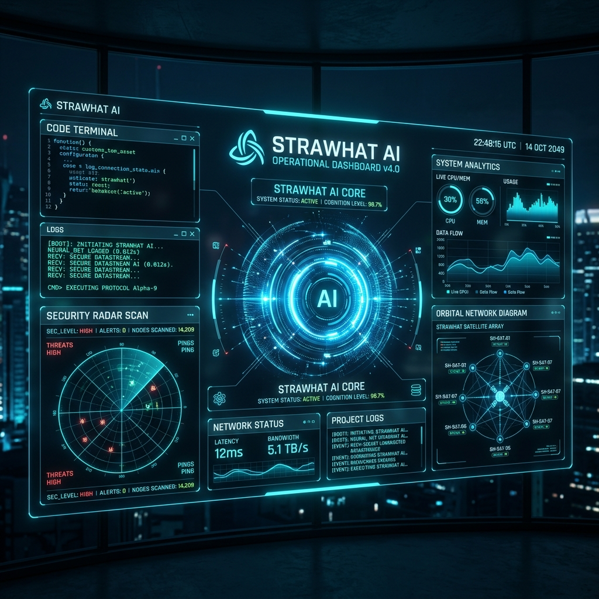

<div align="center">
  
  
  # 🏴‍☠️ StrawHat AI: The Ultimate Autonomous AI Agent
  
  [**Website**](https://straw-hat-ai.vercel.app/) | [**Documentation** (Restricted)](#) | [**API Access** (Private)](#)
  
  [](LICENSE)
  [](#)
  [](#)

  ---

  ### "One AI. Infinite Use Cases. Powered by Autonomy."

  *StrawHat AI is a next-generation autonomous agent designed for high-stakes environments. From automated penetration testing to intelligent automation, StrawHat AI thinks, plans, and executes missions on its own.*

  ---
  
   
  *(Note: The above is a conceptual mockup of the StrawHat AI Control Center)*

</div>

---

## 🚀 Capabilities & Missions

StrawHat AI operates as a set of autonomous "Crews," each specialized in a domain. Whether it's deep-recon on a network or managing complex DevOps pipelines, StrawHat has it covered.

| Domain | Capability | Tools |
| :--- | :--- | :--- |
| **Cybersecurity** | Autonomous Pentesting, Vulnerability Scanning | Kali Linux, Metasploit, Nmap |
| **Development** | Autonomous Coding, Documentation & CI/CD | Docker, Python, GitHub APIs |
| **Automation** | Multi-channel Bots, Workflow Orchestration | WhatsApp Web API, Telegram |
| **Intelligence** | Local Model Hosting & Computer Vision | Ollama, OpenCV, TensorFlow |

---

## 🛠 Tech Stack & Ecosystem

Built for scale and privacy. StrawHat runs on a self-hosted infrastructure to ensure zero-data leaks.

- 🐧 **Kali Linux Cloud Instances**: The primary operating theater for security ops.
- 🐳 **Docker Containerization**: Self-contained environments for every tool and agent.
- 💬 **WhatsApp Web & Telegram APIs**: Real-time mission reports and remote command.
- 🧠 **Ollama & LLM Core**: Private, local inference for critical thinking.
- 👁 **OpenCV**: Vision-based automation for GUI-level tasks.
- 🦀 **Open Claw Project Implementation**: Core orchestration layer for autonomous planning.

---

## ⛓️ Autonomous Workflow

```mermaid
graph TD
    A[User Request] --> B{StrawHat Core}
    B --> C[Situation Analysis]
    C --> D[Tactical Planning]
    D --> E[Tool Execution]
    E --> F[Verification]
    F -- Success --> G[Final Response]
    F -- Failure --> C
    
    subgraph "Infrastructure Layer"
        E --- H[Kali Linux Container]
        E --- I[Docker Runtime]
        E --- J[WhatsApp Integration]
    end
    
    style B fill:#00F0FF,stroke:#222,stroke-width:2px,color:#000
    style D fill:#00F0FF,stroke:#222,stroke-width:2px,color:#000
    style E fill:#00F0FF,stroke:#222,stroke-width:2px,color:#000
```



---

## 📦 Architecture (Showcase)

This repository contains a high-level representation of the StrawHat architecture. 

```python
# StrawHat AI Orchestrator Snippet
from core.brain import AutonomousPlanner
from tools.kali import SecurityScanner

async def start_mission(target_url):
    planner = AutonomousPlanner(context="SecurityAudit")
    plan = await planner.create_plan(target_url)
    
    async with SecurityScanner() as scanner:
        results = await scanner.execute_plan(plan)
        return results
```

Check out the [`src/`](src/) directory to understand our modular approach to building autonomous systems.

---

## ⚖️ License

**© 2026 StrawHat AI. All Rights Reserved.**

This repository is for **demonstration and showcase purposes only**. The source code is proprietary and not open for public distribution or commercial use without a valid license from the StrawHat AI Team.

---

<div align="center">
  <sub>Built with ❤️ by the StrawHat AI Team. Inspired by the spirit of freedom and autonomy.</sub>
</div>
